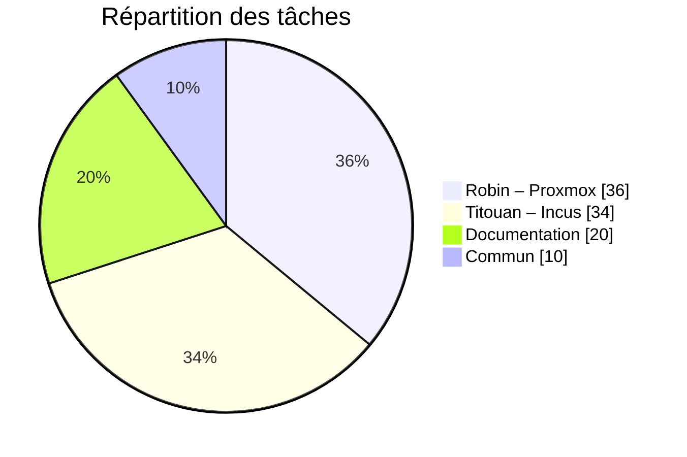

#  Projet SAE3D04 - Infrastructure de Virtualisation

## Tableau des contraintes

| **Catégorie**                           | **Contraintes identifiées**                                                                                                                                                                              |
| --------------------------------------- | -------------------------------------------------------------------------------------------------------------------------------------------------------------------------------------------------------- |
| **Technique – Virtualisation**          | - Support obligatoire de la virtualisation complète (VM Linux/Windows). - Possibilité de créer un cluster à 3 nœuds. - Gestion du stockage distribué et de la HA sans dépendre de licences.        |
| **Technique – Stockage**                | - Besoin d’un stockage distribué tolérant aux pannes (Ceph). - Performances minimales requises pour héberger plusieurs VM. - Gestion simple des disques et des volumes.                            |
| **Réseau**                              | - Support des modes réseau nécessaires : Bridge, NAT, VLAN, MACVLAN. - Accessibilité des services (ex : serveurs web). - Ouverture de ports spécifiques (Corosync, Ceph, UI, services).            |
| **Haute disponibilité**                 | - Nécessite un stockage partagé ou distribué. - Surveillance continue des nœuds. - Migration ou redémarrage automatique des VM en cas de panne.                                                    |
| **Administration**                      | - Interface web centralisée indispensable. - Solution facile à maintenir dans un contexte pédagogique. - Documentation claire + communauté active.                                                 |
| **Sauvegarde**                          | - Compatibilité avec une solution de sauvegarde centralisée (PBS). - Snapshots cohérents et restauration rapide.                                                                                      |
| **Sécurité**                            | - Contrôle des accès. - Gestion des ports réseau. - Isolement réseau pour certaines VM.                                                                                                            |
| **Économie & contraintes pédagogiques** | - Coût très faible : éviter les solutions nécessitant une licence (ex : vCenter). - Doit être installable sur du matériel virtualisé. - Temps limité : solution simple à déployer et à configurer. |

##  Solutions finales choisies - Synthèse des solutions

Au regard des contraintes du projet (budget, pédagogie, flexibilité réseau, stockage distribué, haute disponibilité), Proxmox VE s’impose comme la solution la plus pertinente.
Elle offre un compromis idéal entre fonctionnalités professionnelles, simplicité d’administration, compatibilité large, robustesse et absence de coûts de licence.
Contrairement à ESXi, elle ne dépend pas d’outils payants (vCenter, VSAN) pour activer les fonctionnalités essentielles.
Contrairement à Incus, elle permet la virtualisation complète et la mise en place d’un véritable cluster HA avec Ceph.

Proxmox VE est donc la solution retenue, car c’est la seule capable de satisfaire l’ensemble de nos besoins techniques tout en restant accessible, évolutive et performante.

| **Critère**                 | **VMware ESXi**                                 | **Proxmox VE**                         | **Incus**                                     |
| --------------------------- | ----------------------------------------------- | -------------------------------------- | --------------------------------------------- |
| **Type de virtualisation**  | Virtualisation complète                         | KVM (VM) + LXC (conteneurs)            | Conteneurs système                            |
| **Licence**                 | Propriétaire, fonctionnalités avancées payantes | 100% open‑source                       | Open‑source                                   |
| **Cluster**                 | Oui, via vCenter (payant)                       | Oui, natif et gratuit                  | Oui (cluster de conteneurs)                   |
| **Haute disponibilité**     | Oui, via vCenter HA (payant)                    | Oui, nativement (Proxmox HA + Ceph)    | Partielle (containers)                        |
| **Stockage distribué**      | VSAN (payant)                                   | Ceph intégré natif                     | ZFS mais pas Ceph                             |
| **Migration à chaud**       | vMotion (licence)                               | Live migration gratuite                | Non applicable                                |
| **Gestion réseau**          | Bridge / VLAN                                   | Bridge / NAT / VLAN / MACVLAN / SR‑IOV | Bridge / NAT                                  |
| **Accès et administration** | Interface mais dépendante de vCenter            | Interface web centrale complète        | Interface moderne en ligne de commande et API |
| **Sauvegarde**              | Outils tiers (Veeam, payants)                   | Proxmox Backup Server (PBS)            | Snapshots intégrés                            |
| **Support OS invités**      | Tous OS                                         | Tous OS                                | Linux uniquement                              |
| **Performance**             | Très élevée                                     | Très élevée                            | Excellente (containers)                       |
| **Coût**                    | Élevé                                           | faible / gratuit                       | Gratuit                                       |
| **Adapté à notre projet ?** | Trop cher, trop fermé                           | Parfaitement adapté                    | Trop limité                                   |

##  Tableau comparatif des coûts

Dans le cadre de notre projet, nous avons choisi de déployer une infrastructure composée de trois serveurs.
Ce choix n’est pas arbitraire : plusieurs fonctionnalités essentielles exigent au minimum trois nœuds pour fonctionner correctement, notamment :

    le cluster Proxmox (quorum stable à 3 nœuds),

    le stockage distribué Ceph (au moins 3 OSD pour assurer la réplication),

    la haute disponibilité (HA), qui nécessite au moins 2 nœuds actifs + 1 pour maintenir le quorum.

Ainsi, pour pouvoir mettre en œuvre une architecture réellement résiliente, tolérante aux pannes et professionnelle, il est indispensable de comparer les solutions logicielles dans une configuration à trois serveurs.

| **Élément évalué**                               | **VMware ESXi**                                                                     | **Proxmox VE**                                       | **Incus**                                          |
| ------------------------------------------------ | ----------------------------------------------------------------------------------- | ---------------------------------------------------- | -------------------------------------------------- |
| **Coût de base (hyperviseur)**                   | Gratuit (ESXi Free)                                                                 | 0 €                                                  | 0 €                                                |
| **Gestion centralisée**                          | **vCenter Essentials — 600 € / an** (pack pour 3 serveurs)                          | Inclus → **0 €**                                     | 0 €                                                |
| **Haute disponibilité (HA)**                     | Inclus uniquement avec **vSphere Essentials Plus — 5 000 € / an** (pack 3 serveurs) | Inclus → **0 €**                                     | Fonction limitée → **0 €**                         |
| **Migration à chaud (vMotion)**                  | Inclus dans **Essentials Plus — 5 000 € / an**                                      | Inclus → **0 €**                                     | Non applicable                                     |
| **Stockage distribué (vSAN / Ceph)**             | **vSAN Standard : ~6 000 € / an pour 3 serveurs CPU      | Ceph intégré → **0 €**                               | Non natif → 0 €                                    |
| **Sauvegarde centralisée**                       | Outils tiers (Veeam) — **500 à 1 000 € / an**                                       | Proxmox Backup Server (open‑source) → **0 €**        | Snapshots → 0 €                                    |
| **Support / mises à jour pro**                   | Inclus dans les licences VMware                                                     | Optionnel : **95 € / an / serveur** → **285 € / an** | Gratuit                                            |
| **Coût total minimal (cluster sans vSAN)**       | **~5 000 € / an**                                                                   | **0 €**                                              | **0 €**                                            |
| **Coût total complet (cluster + vSAN + backup)** | **~11 000 – 12 000 € / an**                                                         | **0 €** (ou 285 €/an avec support)                   | **0 €**                                            |
| **Adapté au projet ?**                           |   Non : coût annuel trop élevé                                                      |   Oui : complet et gratuit                           |  Non : ne supporte pas la virtualisation complète |

## Discussion avec un ancien de l'IUT

À la suite de cet échange avec Yohann Ansinelli, il ressort que dans son travail il se repose principalement sur deux solutions de virtualisation à savoir Proxmox et VMware, ce dernier étant administré via vCenter. L’utilisation conjointe de ces outils s’inscrit dans un contexte professionnel où la virtualisation joue un rôle central dans la gestion des infrastructures, aussi bien pour l’hébergement de machines virtuelles que pour l’administration centralisée des ressources. VMware demeure une solution largement utilisée pour sa robustesse, son écosystème mature et les fonctionnalités avancées offertes par vCenter, notamment en matière de gestion, de supervision et d’organisation des environnements virtualisés. En parallèle, Proxmox est également employé comme solution de virtualisation, appréciée pour sa flexibilité et son modèle économique plus accessible. Le choix entre ces deux technologies ne repose pas uniquement sur des critères techniques, mais également sur des considérations liées aux coûts de licences, aux compétences disponibles au sein des équipes et à l’existant de l’infrastructure. 

##  Discussion avec un professionnel

Lors de cet échange avec Kylian Toulliou, celui-ci a expliqué que l’infrastructure de l’entreprise repose historiquement sur VMware, une solution souvent imposée par les choix passés de l’organisation et largement déployée car elle répondait à l’ensemble des besoins de virtualisation. Toutefois, malgré sa maturité et sa stabilité, VMware est aujourd’hui progressivement abandonné en raison de son coût de licences jugé trop élevé, ce qui pousse l’entreprise à revoir sa stratégie. Dans cette optique, Proxmox est étudié comme une alternative sérieuse afin de libérer les licences VMware, avec une phase actuelle de découverte, d’analyse des fonctionnalités et de montée en compétences des équipes, d’autant plus que Proxmox propose des mécanismes proches de ceux de VMware. Il est perçu comme une solution efficace et relativement simple à utiliser, offrant de nombreuses possibilités, même si certaines opérations peuvent s’avérer plus complexes et nécessiter des manipulations techniques plus poussées. Concernant OpenStack, la solution n’est plus exploitée dans l’infrastructure, principalement par manque de compétences internes pour assurer sa maintenance et ses mises à jour, ce qui la rend peu adaptée au contexte de l’entreprise. Par ailleurs, Kylian Toulliou a souligné que l’entreprise utilise désormais Kubernetes de manière quasi quotidienne, y compris dans des contextes qui ne relèvent pas strictement de la virtualisation classique, afin de mutualiser les ressources, qu’il s’agisse de machines virtuelles ou de serveurs, et d’optimiser l’utilisation de l’infrastructure. Kubernetes est ainsi employé comme un levier de rationalisation des ressources et de réduction des coûts, en permettant une meilleure gestion des charges, une plus grande flexibilité et une exploitation plus efficace des capacités disponibles, s’inscrivant pleinement dans la stratégie globale d’optimisation et de modernisation de l’infrastructure de l’entreprise.

##  Répartition générale des tâches

### Répartition des tâches

| Tâche | Pourcentage | Visualisation |
|------|-------------|---------------|
| Proxmox / Ceph | 40% | ████████ |
| Incus | 30% | ██████ |
| Documentation | 20% | ████ |
| Tests | 10% | ██ |

